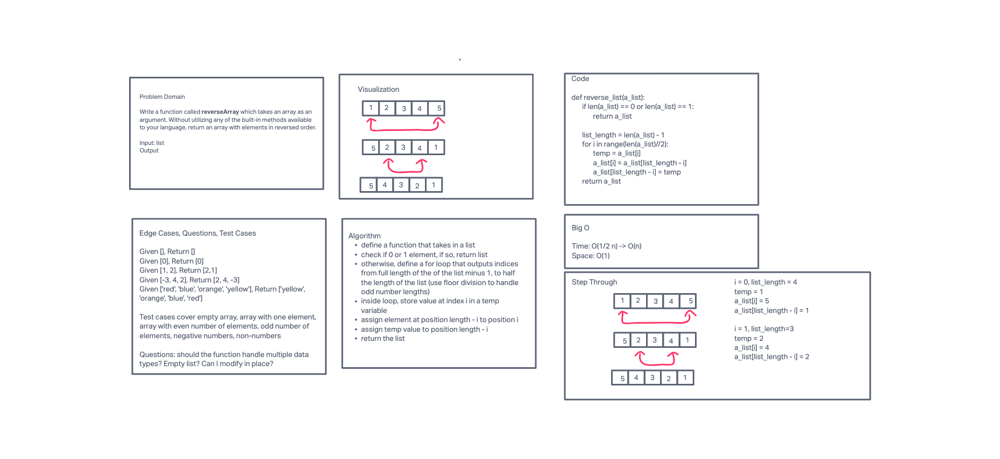

# Reverse an Array
Write a function called reverseArray which takes an array as an argument. Without utilizing any of the built-in methods available to your language, return an array with elements in reversed order.

## Whiteboard Process

## Approach & Efficiency
We used this algorithm because it was more efficient (space and time) than using a decrementing for loop that pushes the last element to a new list with each iteration and then return the new list.
See whiteborad for Big O analysis.

## Collaborators
Jae Loney
Jacob Amsbury
