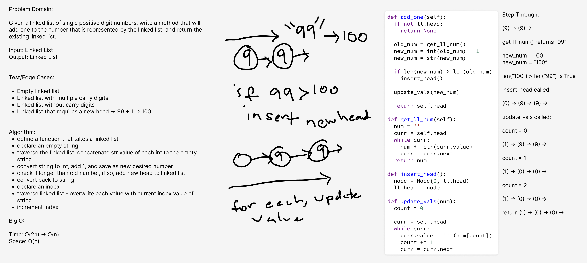

# Add One to Linked List

Write a method that takes a linked list of single-digit positive integer that represent a number. Return a linked
list with one added to the number.

## Whiteboard Process

## Approach & Efficiency

Time: O(2n) -> O(n)\
Space: O(n)
