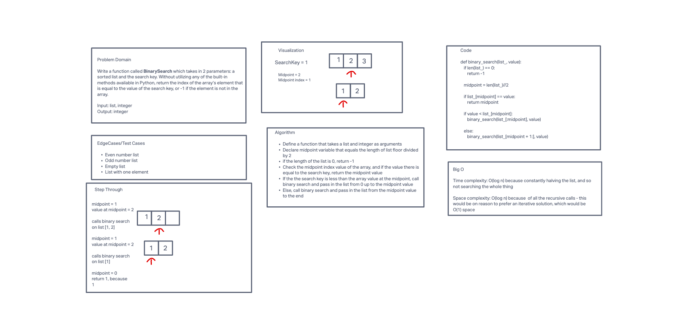

# Binary Search of Sorted List
Problem Domain
Write a function called BinarySearch which takes in 2 parameters: a sorted list and the search key. Without  utilizing any of the built-in methods available in Python, return the index of the array’s element that is equal to the value of the search key, or -1 if the element is not in the array.

Input: list, integer
Output: integer

## Whiteboard Process

## Approach & Efficiency
I used a recursive solution for concise code and readability, since binary search lends itself well to a readable recursive algorithm. The time complexity is O(log n), which I believe is the same as for an iterative algorithm. The space complexity though is O(log n) compared to O(1) for an iterative algorithm, so I traded off some memory for readability and concise code.
