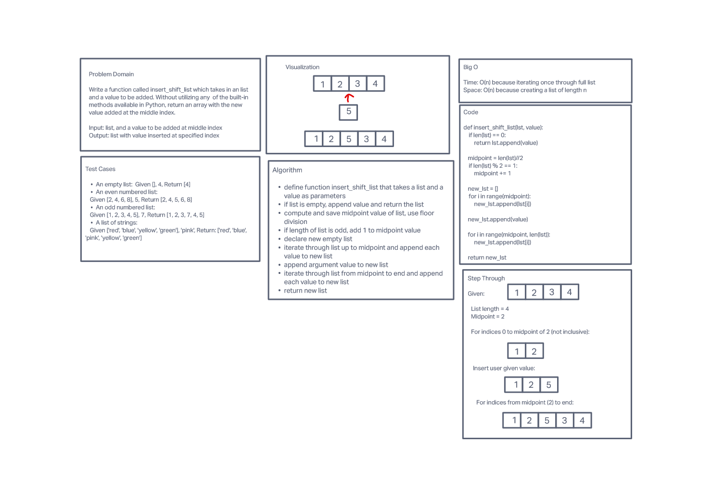

# Insert-Shift-List
Write a function called insert_shift_list which takes in a list and a value to be inserted. Without utilizing any of the built-in Python methods, return a list with the new value inserted at the middle index.

## Whiteboard Process

## Approach & Efficiency
We iterated through the first half of the list and added those values
to a new list. Then we appended the user supplied value. Then we
iterated through the second half of the list, adding these values
to the new list. We then returned the new list.
This algorithm has both a time and space complexity of O(n), since
we iterate once through the entire list of length n. Additionally,
we store a new list of length n.

## Collaborators
Daniel Brott
