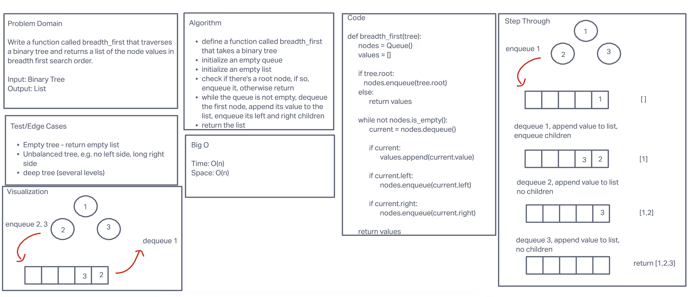

## Breadth First Tree Search

### About

This function does a breadth-first traversal of a binary tree and returns a list of the stored values in
breadth-first order.

### Efficiency

Time: O(n) - because visiting every node in the tree\
Space: O(n) - because storing a value for each node in the tree

### Whiteboard

### Solution

This algorithm uses a queue to complete breadth-first search. Initialize an empty queue. Enqueue the root node. While
the queue is not empty, dequeue the first node, append its value to a list, and enqueue the node's children. Finally,
return the list of values.
