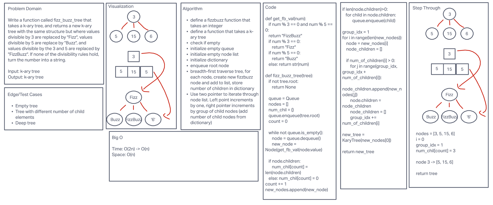

## FizzBuzz K-ary Tree

### About

The fizz_buzz_tree function takes a k-ary tree, and returns a k-ary tree whose structure is equivalent, but whose
integer values are replace by FizzBuzz values, meaning, values divisible by 3 are replaced by "Fizz", values
divisible by 5 are replaced by "Buzz", and values divisible by both 3 and 5 are replaced by "FizzBuzz". All other
integers are converted to string representations of the original value.

### Efficiency
Time: O(n)\
Space: O(n)

### Whiteboard

