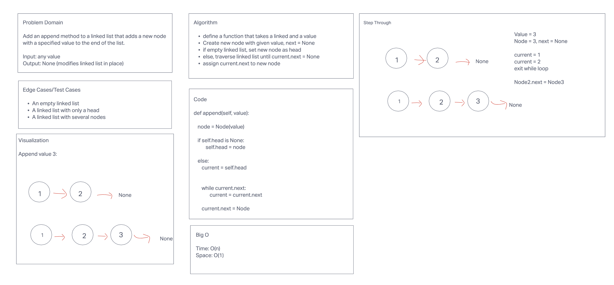
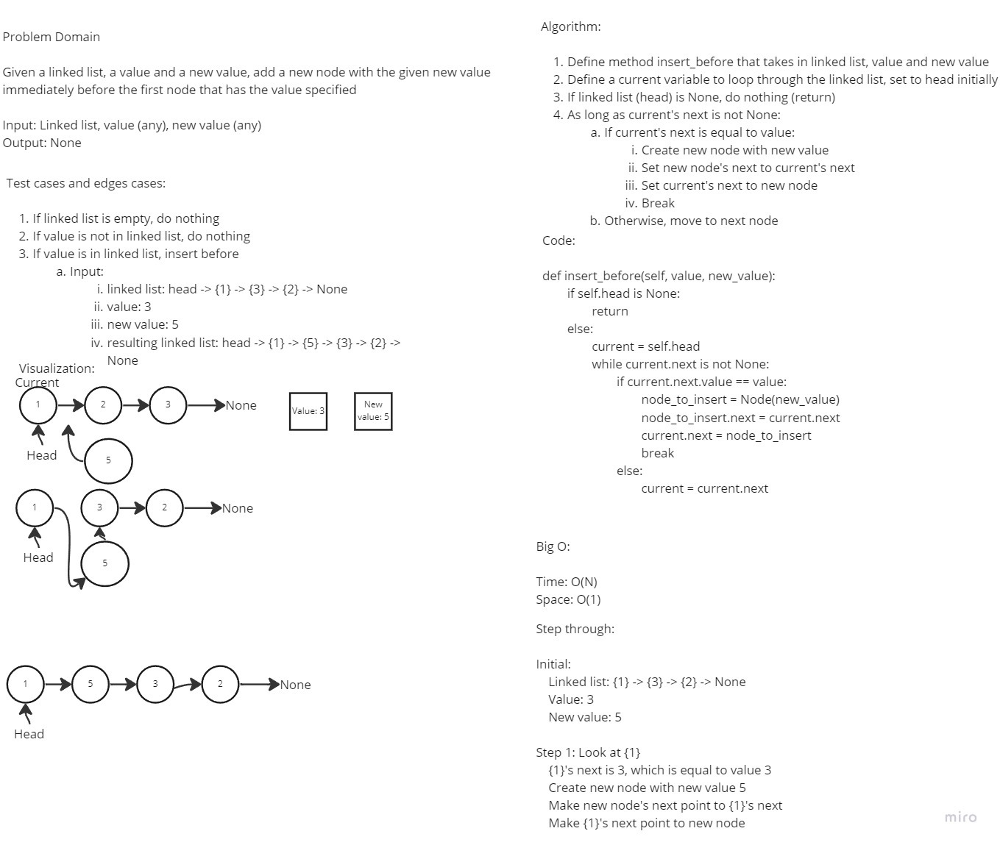
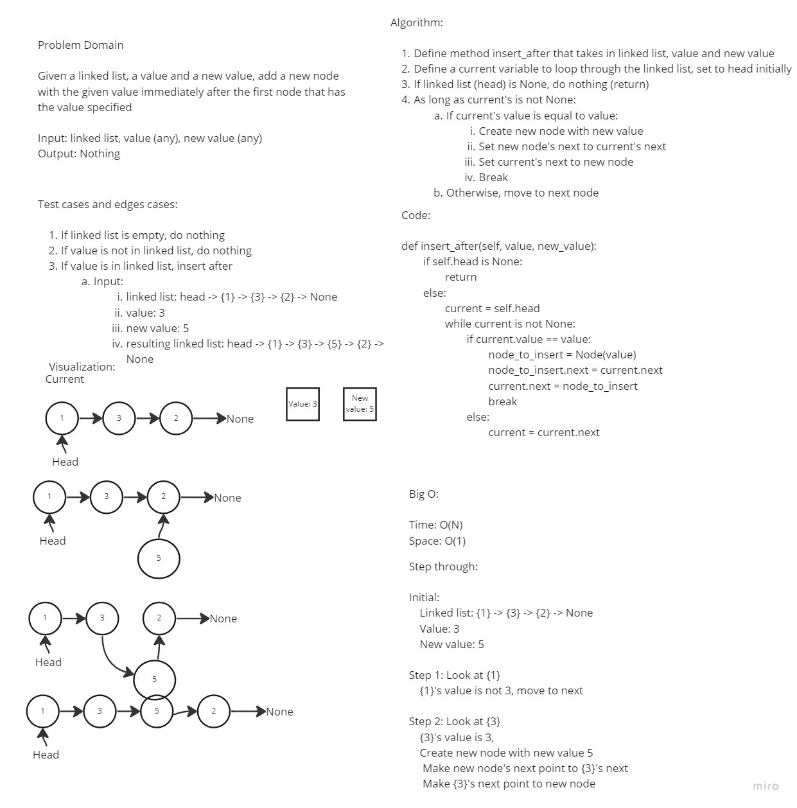
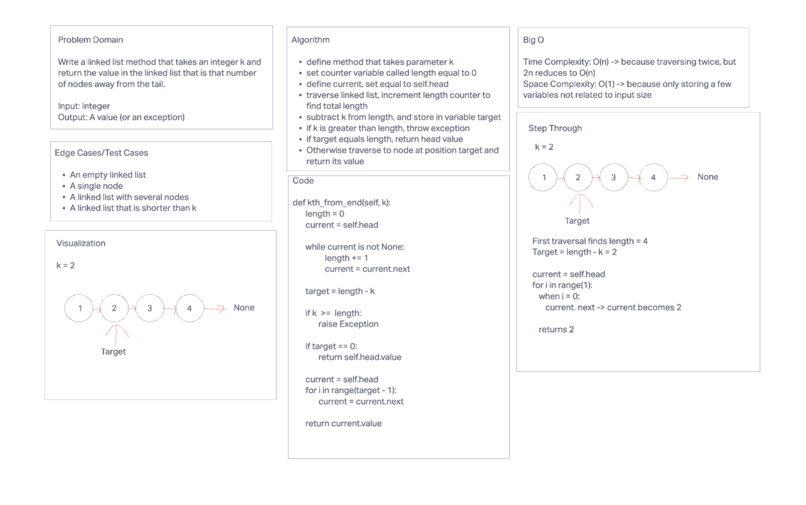

# Singly Linked List
A singly linked list consists of nodes, each of which contains a value and a reference to the next node in the ordered
list of nodes. The linked list variable holds a reference to the head node. The tail node of the linked list holds a
reference to None.

## Challenge
Implement a LinkedList class and a Node class with appropriate methods (see below).

## Approach & Efficiency
Adding to the front of the linked list can be done in constant time. Traversing the list is O(n). Similarly, any operation
that requires traversing the list, such as adding an element to the end, or checking for a value, is also O(n) time.

## API
Description of each method publicly available in Linked List Class:
- __str__ which prints a string representation of the full linked list
- insert which adds a new node to the head of the linked list
- includes which returns True if a given value is in the linked list and False otherwise

## Whiteboard Collaborators
Andy Nguyen (Append, Insert Before, Insert After)
Alejandro Rivera (Kth from End)

## Append Whiteboard

## Insert Before Whiteboard

## Insert After Whiteboard

## Kth from End Whiteboard

