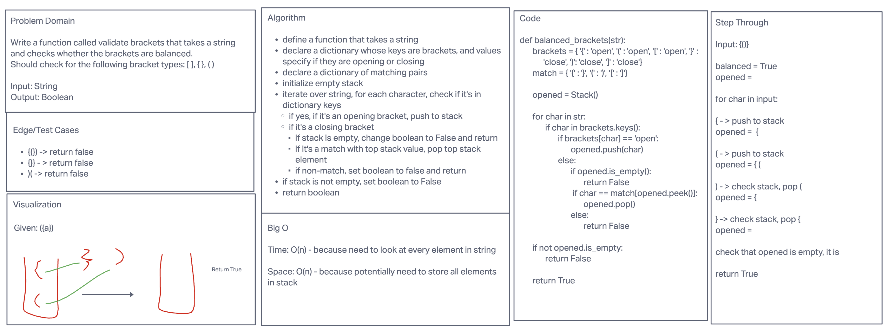

# Validate Brackets

This function accepts a string and checks to see if brackets are balanced. It uses a stack to confirm that each
opening bracket has the appropriate closing bracket in the proper order.

Bracket pairs supported are (), {}, []

## Efficiency

Time: O(n)
Space: O(n)

## Whiteboard

