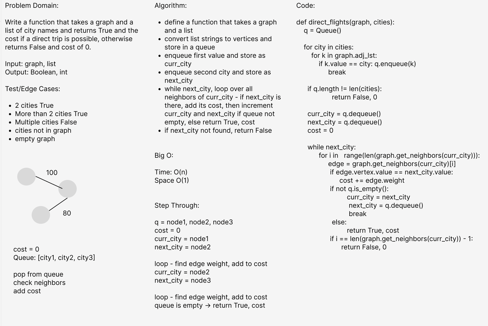

# Challenge Summary

Write a function that takes a graph and a list of city names and returns True and the cost if a direct trip is possible, otherwise returns False and cost of 0.

## Whiteboard Process

## Approach & Efficiency

Time: O(n)
Space: O(1)

## Solution

pytest tests/code_challenges/test_graph_business_trip.py
