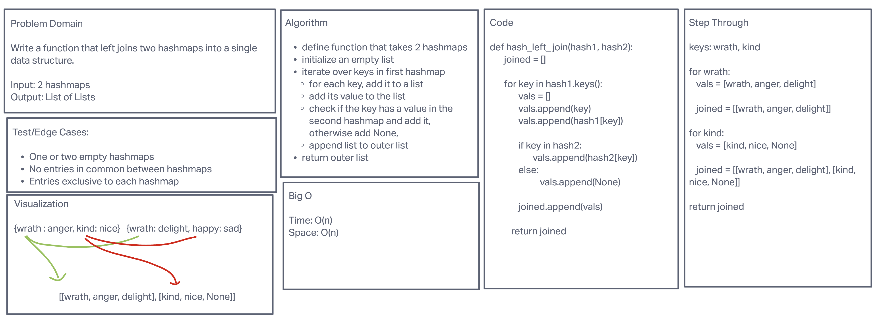

# Hashmap Left Join

This function takes two hashmaps and returns a left joined list of lists. In the output list, each inner
list is a key that appeared in the first hashmap, followed by the associated value, followed by the key's value in
the second hashmap if it exists, or otherwise None.

## Whiteboard Process

## Approach & Efficiency

While hashmap lookups can be done in constant time, O(1), all the keys in the first hashmap, and potentially the
second hashmap, must be retrieved and added to the new data structure. Therefore, the time complexity is O(n). Since
all values must be stored in the new data structure, the space complexity is also O(n).

Time: O(n)\
Space: O(n)

## Run

Run test cases: pytest tests/code_challenges/test_hashtable_left_join.py
