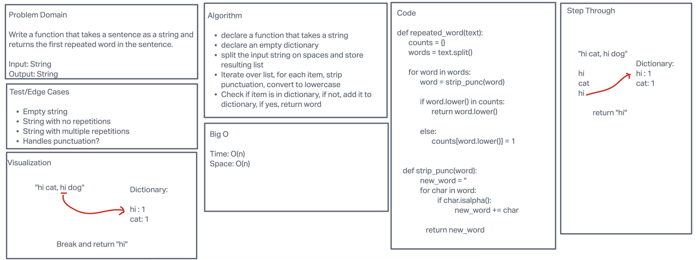

# Hashtable Repeated Word

Using a hashtable data structure, write a function that takes a sentence and returns the first word in the sentence
that is repeated.

## Whiteboard Process

## Approach & Efficiency

Time: O(n)\
Space: O(n)

## Solution

Run test cases: pytest tests/code_challenges/test_hashtable_repeated_word.py
