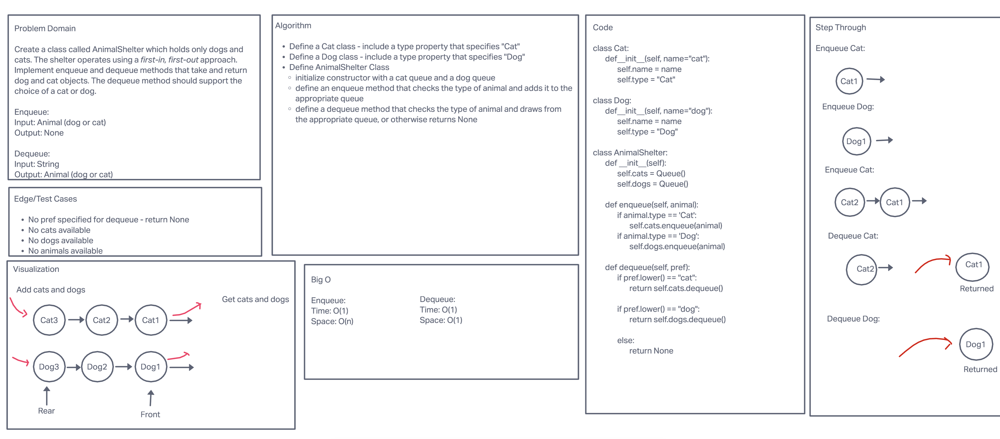

# Animal Shelter

This project uses two queues to simulate an animal shelter that allows for adoption of cats and dogs. Cat and Dog
objects are defined, with the option to provide a name for the animal. The AnimalShelter class supports an enqueue
method to add animals (cats and dogs), and a dequeue method to remove (adopt) a cat or dog - the preference for a
cat or dog must be specified to receive an animal. Cats and dogs who have waited the longest get adopted first.

Enqueue: takes an animal (cat or dog) and adds it to the shelter\
Dequeue: takes a preference (cat or dog), and returns the animal that satisfies the preference and has waited
longest for a home

## Efficiency

Animals can be added and adopted in O(1) time. Housing animals takes O(n) space.

## Whiteboard

