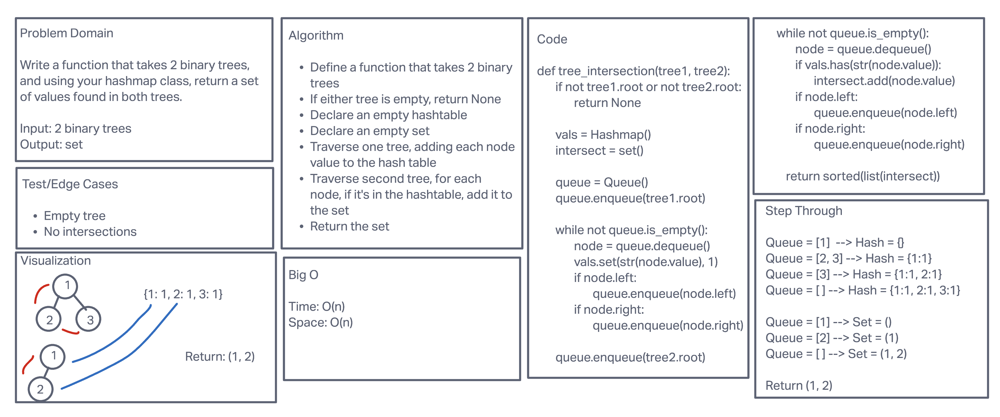

# Tree Intersection

Write a function that takes two binary trees and returns a list of the values they have in common.

## Whiteboard Process

## Approach & Efficiency

Time: O(n)\
Space: O(n)

## Solution

Run test cases: pytest tests/code_challenges/test_tree_intersection.py
